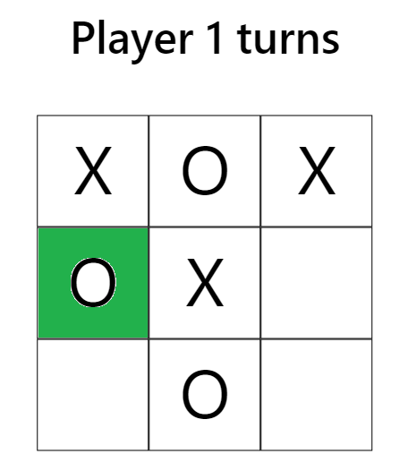

# TicTacToeJS

To implement this game I have used OOPs features of programming and hash map data structure to store the possible combinations that will result into winning of a player.

Working:

- For first four game play we are not calling the winner Calculator function as for a player to win he/she must have filled 3 blocks.
- On fifth and onward game play the we select the block filled by the player and for that block we check if its consutive block forms the winning condition for that palyer.

Example : On 5th game play player with symbol "X" clicked on center (block 5) .

Now the player will win if the symbol "X" is present either on position (2,7), (1,9) and (3,7) and we checking for the presence of "X" in these blocks only.

On 6th Game Play  

Player with symbol "O" clicked on 4th block and we are checking the precence of "O" on position (1,7) and (5,6). and it gose on  for every game play.

